# 程序员的数学

## 0的故事--无即是有

- 要点：按位计数法，0的作用

- 案例：理解0的作用，生活中的0的案例
  
  - 没有计划的计划，使用0来表示自由时间下的空计划，起到占位的作用
  - 没有药效的药，周一到周六吃药，周天不吃药，使用0来表示周天，简化规则为，每天吃药，周天吃没有效果的药。

- 按位计数法
  
  - 二进制、八进制、十进制、十六进制都是按位计数法。
  
  - 罗马数字：不使用按位计数，不含零，数位没有意义，计数麻烦

- 指数法则：a^n*a^m=a^(n+m)

- 0的作用：1.用来占位，确保位数高于它的数字不会产生错位. 2.统一标准，简化规则。

- 问题分解法：

- 按位计数法的产生：
  
  - 为什么要发明计数法：数字越大就越难处理
  
  - 12个罗马数字I，由XII代替，又被12代替，更是简单
  
  - 将大问题分解成小的“单元”

## 逻辑--真与假的二元世界

- 要点：使用逻辑表达式、真值表、文式图、卡诺图来解析复杂的逻辑。

- 自然语言存在歧义，所以需要使用逻辑来消除歧义

- 命题：能够判断真假的陈述语句

- 规则：
  
  1. 规则的完整性：确定规则没有遗漏
  
  2. 规则的排他性：确定规则没有重复
     
     - 案例：乘车费用问题

- 复杂命题
  
  - 与、或、非
  - 异或：只有当A和B不相同时，才为True。例如：楼梯口使用两开关控制一盏灯。
  - 相等：异或的否定
  - 摩根定律：
    1. “非A”并且“非B”，和非“A或B”是等价的
    2. “非A”或者“非B”，和非“A与B”是等价的

- 文氏图：直观

- 卡诺图
  
  . 将所有命题的真假组合以二维表的形式表示的图。
  
  . 适用于：简化逻辑表达式，设计逻辑电路等
  
  - 案例：二灯游戏、三灯游戏。

- 未定义值的三值逻辑

## 余数--周期性和分组

要点：余数的作用，余数就是分组，

- 周期性：对庞大的数值，发现其周期性并使用余数，就能够简化问题
  - 星期数的思考
- 奇偶性：
  - 满足一笔画的条件：
  - 当起点和终点一致时，顶点都是偶点时才能一笔画
  - 当起点和终点不一致时，除了起点和终点是奇点，其余的必须是偶点
  - 案例：寻找恋人，8个村庄可分为奇数村和偶数村
  - 案例：黑白棋通讯
  - 案例：铺设草席
- 利用周期性和奇偶性，将大问题简化成小问题。

## 数学归纳法--如何征服无穷数列

- 思考题：存钱罐里的钱
  
  - 推到出$1+2+3+...+n=n(n+1)/2$
  
  - 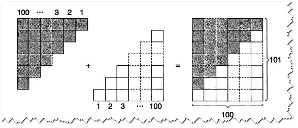

- 数学归纳法：
  
  - 定义：是用来证明有关整数的断言对所有整数（0、1、2、3...）是否成立时所用的方法
  
  - 多米罗骨牌原理
    
    - 确保前一个骨牌到下能带倒后一个骨牌
    
    - 推到第一个骨牌
  
  - 证明断言A(n)成立的两个步骤
    
    - 基底：A(0)成立
    
    - 归纳：证明如果A(k)成立时，A(k+1)也成立

- 实例：
  
  - 奇数之和：$1+3+5+...+（2n-1）=n^2$
  
  - 图示化说明：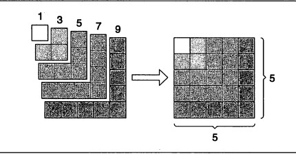

- 数学归纳法于编程的关系
  
  - 通过循环表示数学归纳法
  
  - 循环不变式：每次循环都成立的逻辑表达式，相当于数学归纳法的断言

## 排列组合--解决计数问题的方法

- 计数
  
  - 注意遗漏和重复

- 植树问题
  
  - 不要忘记0

- 加法原则：要数出两个集合的的事物时，可以使用加法原则
  
  - 运用前提：两个集合没有交集
  
  - 容斥原理运用：将两个集合元素数相加，然后减去重复的部分
  
  - 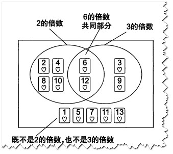

- 乘法原则：两个集合进行元素配对的法则
  
  - 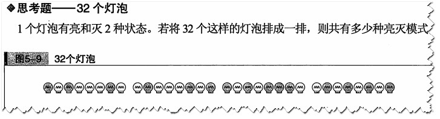

- 置换：将n个事物按顺序进行排列
  
  - 阶乘：阶状递减相乘
  
  - 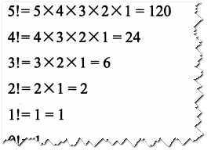

- 排列：排列是特殊的置换，从n个不同的事物中取出k个按照顺序排列
  
  - 用阶乘表示排列
    
    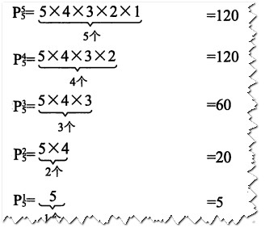

- 组合：不考虑顺序的排列
  
  - 计数方法：先考虑顺序进行计数，然后除以重复度
  
  - 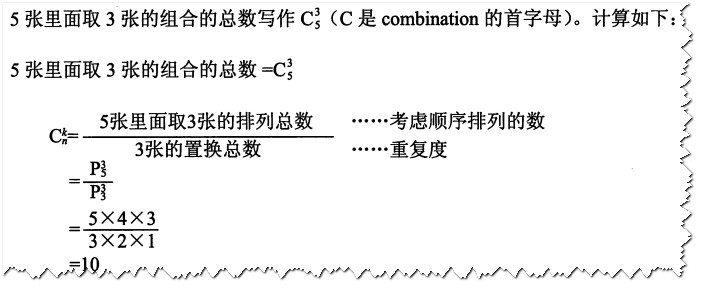

- 置换、排列和组合之间的关系
  
  - 排列=置换 x  组合
  
  - 从五张牌里选出三张排列=三张置换  x   从五张牌里选出三张组合

- 认清计数对象的性质

- 练习题
1. 药品调剂
   - 重复组合问题
   
   - 隔板法

2- 至少一端是王牌

- 排列

- 第一种思路，使用加法原则分情况讨论

- 第二种思路，通过否命题间接求出答案

## 递归--用自己定义自己

- 定义：用自己定义自己，用自己推导自己

- 汉诺塔谜题：从n-1层汉诺塔解出n层汉诺塔

- 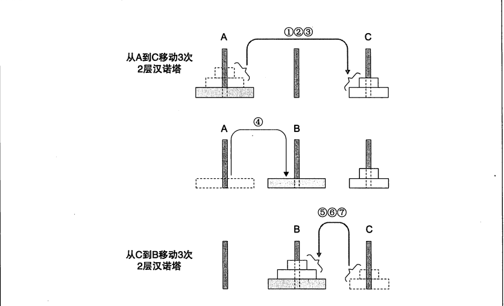

- n层汉诺塔移动需要的次数：H(n)=H(n-1)+1+H(n-1)

- 递推公式：我们将同时包含H(n)和H(n-1)的公式称为递推公式

- 阶乘：用n-1！求出n！
  
  - 用递归的公式表达：n! = n×(n-1)!

- 递归VS归纳
  
  - 本质是都是***将复杂的问题简单化***
  
  - 不同是：递归是在一般性前提推出个别性结论
    
    - 归纳是在个别性前提推出一般性结论

- 斐波那契数列
  
  - 不断繁衍的动物
    
    - n-1天的动物依旧存活着
    
    - n-2天以前的动物 会在n天繁殖一代
    
    - H(n)=H(n-1)+H(n-2)
    
    - 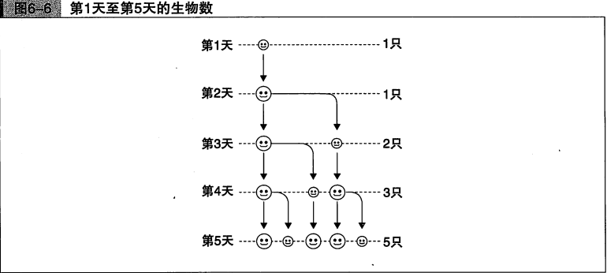

- 杨辉三角
  
  - 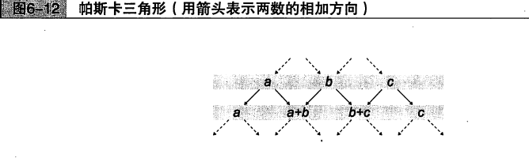
  
  - 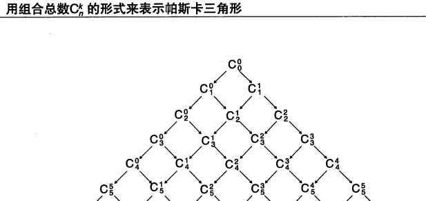

- 用递归表示组合
  
  - 

- 使用递归的观点解决问题的关键：找到隐含的**“递归结构”**

- 编程中的递归结构：代码的缩进、树型数据结构、快速排序算法
