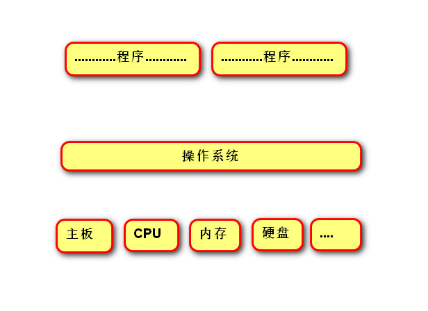
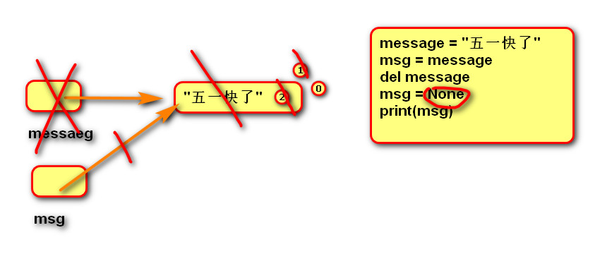
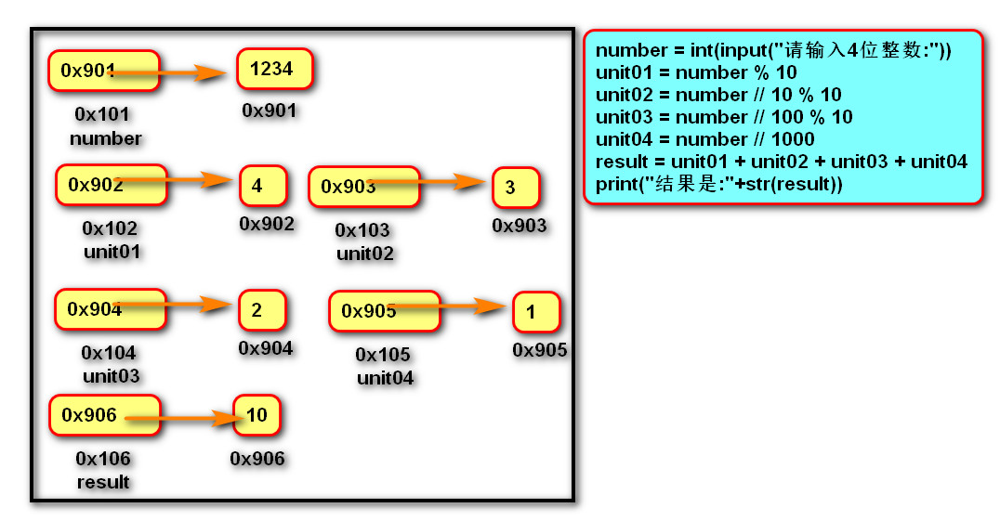
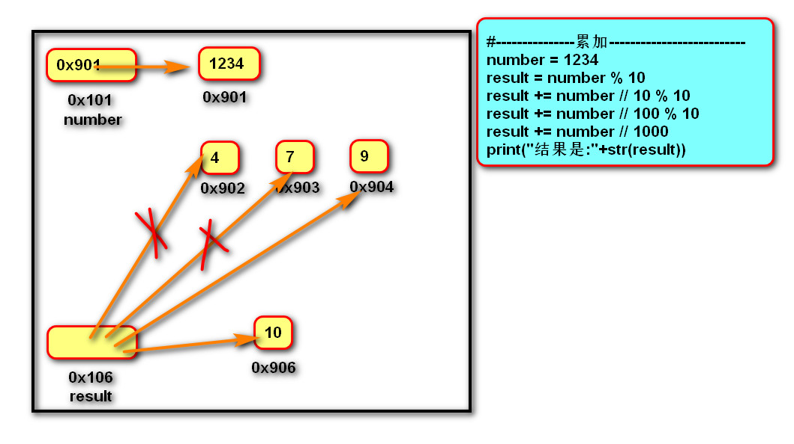

## 学习的方法

1. 掌握知识点（定义、作用、适用性、语法），适用性最是关键的  
2. 三合一：理论知识，练习代码，示图  
3. 练习  
4. 交流学习，群里讨论  

## Python简介

- 免费、开源、跨平台、动态、面向对象的编程语言  
- 常识：程序员，程序，操作系统，硬件  
  
  

### Python程序的执行

- 程序的执行方式
  
  1. 交互式  
  2. 文件式  

- 程序的执行过程
  
  - 编译:程序运行前，通过编译器将源代码转换成机器语言。例如：C语言  
    
        - 特点：运行速度快，开发效率低，不能跨平台  
  - 解释：程序运行时，通过解释器逐行翻译，然后执行。例如：Java语言  
    
        - 特点：运行速度慢，开发效率高，跨平台  
  - Python的执行过程  
    - 代码->编译->*字节码*->解释->机器语言  
    - 只在第一次运行代码时执行编译过程，并生成.pyc文件  

### 解释器(interpreter)类型

1. CPython（C语言）  
2. JPython（Java语言）  
3. IronPython (.net开发)  
- 设计程序的三步骤
  
  - 拿：获取数据 干：逻辑处理 呈现出来：显示结果  

## 数据的基本运算

- 注释
  
  - 单行注释，多行注释  

### pycharm常用快捷键

- 代码编辑  
1. 移动到本行开头：home键  
2. 移动到本行末尾：end键  
3. 注释代码：ctrl + /  
4. 复制行：ctrl +d  
5. 选择列：鼠标左键 + alt  
6. 移动行：Ctrl + shift + 上下箭头  
7. 智能提示：Ctrl + Space  
8. 规范代码：Ctrl + alt + l  
9. 删除行：shift + delate  
- 其他  
1. 运行py代码 Ctrl + shift + F10  
2. 折叠代码 Ctrl + Numpad +  
3. 展开代码 Ctrl + Numpad -  

### 函数

- 表示一个功能。先定义，后调用。  
- 如：print、input都是一个函数，分别表示显示功能、接收用户输入功能  

### 变量

- 定义：关联一个对象的标识符。变量名是数据内存地址的别名

- 适用性：临时存储数据的容器

- 语法：变量=表达式  变量1=变量2=表达式  变量1，变量2=表达式1，表达式2
  
  - 命名：1.必须是字母或下划线开头，后跟字母、数字、下划线。  2.不能使用关键字(蓝色)  
  
  - 建议命名法：1.字母小写，如果多个单词以下划线分割  2.见名知意

- 内存原理：变量的内存存储的是数据的内存地址，而不是直接存储数据

- 内存图：
  
  - 变量：由内存内容、变量名、变量内存地址
  
  - 数据：内存内容、内存地址
  
  - 内存只用于存储，不用于计算，所以内存图只显示运算结果，不显示运算过程
  
  - 
  
  - 练习:两个变量交换
    
    ```
    # 借助第三个变量进行交换（跨语言的编程思想）
    # c = a
    # a = b
    # b = c
    
    # 直接交换（python的独特方式） 
    a, b = b, a
    ```

- del语句 
  
  1. 语法:del 变量名1, 变量名2...
  
  2. 作用：用于删除变量，同时解除与对象的关联关系。如果可能则释放对象。
  
  3. 引用计数：自动化内存管理中，每个对象记录被变量绑定(引用)的数量,当为0时被销毁)。
     
     

### 核心数据类型

- 在python中变量没有类型，但关联的对象有类型。

- 通过type函数可查看。
  
  - 整型int
    - 包含正数、负数、0
    
    - 字面值：
      
      | 进制   | 语法                   |
      | ---- | -------------------- |
      | 二进制  | 以0b开头的   0b10110表示22 |
      | 八进制  | 以0o开头     0o10表示8    |
      | 十进制  | 数字                   |
      | 十六进制 | 以0x开头    0xf表示15     |
    
    - 小整数对象池：CPython 中整数 -5 至 256,永远存在小整数对象池中,不会被释放并可重复使用。（两个大整数相等时，内存地址不一样）
    
    - ```
      >>> num01=-5
      >>> num02=-5
      >>> num01 is num02
      True
      >>> num03=256
      >>> num04=256
      >>> num03 is num04
      True
      ```
  - 浮点型float
    - 表示小数，包含正数、负数，0.0)。
    - 字面值
      - 小数：1.0   5.3
      - 科学计数法：e/E(正负号)指数，1.23e-2（等同于0.0123） 1.23e2（等同于123）
    - 小数的四舍五入：round（数据，保留的位数）
  - 空值对象none
    - 作用：占位 解除变量绑定关系
  - 字符串str
    - 用来记入文本信息
    - 可以用单引号和双引号，推荐使用双引号（兼容其他语言）
  - 复数complex 
    - 虚部和实部 如：c01 = 1+2j
  - 布尔bool 
    - 只有Ture和Flase两个值
    - 命题：能判断真假的陈述句
  - 类型转换
    1. 转换为整形: int(数据）
    2. 转换为浮点型:float(数据)
    3. 转换为字符串:str(数据)
    4. 转换为布尔:bool(数据）
       - 结果为False：bool(0)  bool(0.0)  bool(None)  
    5. 混合类型自动升级：
       - 1 + 2.14  返回的结果是 3.14
       - 1 + 3.0   返回结果是:  4.0

### 运算符

- 算术运算符  
  
  - /除法：结果是浮点型
  - //地板除： 结果是整型，除去小数后面的数
  - %取余：可用于判断奇偶数。获取数的个位。
  - **幂运算
  - 优先级：（）>**> * /  //  %>+ -

- 增强运算符  
  
  ```y
  y += x 等同于 y = y + x
  y -= x 等同于 y = y - x
  y *= x 等同于 y = y * x
  y /= x 等同于 y = y / x
  y //= x 等同于 y = y // x
  y %= x 等同于 y = y % x
  y **= x 等同于 y = y ** x
  ```
  
  - 练习：整数每位相加
  
  ```
  - 采用累加的思想，减少了变量的使用，相对与直接运算占用更小的内存
    number = int(input("请输入4位整数:"))
    unit01 = number % 10
    unit02 = number // 10 % 10
    unit03 = number // 100 % 10
    unit04 = number // 1000
    result = unit01 + unit02 + unit03 + unit04
    print("结果是:"+str(result))
  
    #---------------累加--------------------------
    result = number % 10
    # result = result + number // 10 % 10
    result += number // 10 % 10
    result += number // 100 % 10
    result += number // 1000
    print("结果是:"+str(result))
  ```
  
  
  
  

- 比较运算符  
  
  ```
    <        小于
    <=        小于等于
    >        大于
    >=        大于等于
    ==        等于
    !=        不等于
    返回布尔类型的值
    比较运算的数学表示方式:0 <= x <= 100
  ```

- 逻辑运算符
  
  - 多个条件的逻辑运算
  
  - 真值表
    
    | 条件1   | 条件2   | 与运算结果(一假俱假) | 或运算结果（一真俱真） |
    | ----- | ----- | ----------- | ----------- |
    | True  | Flase | Flase       | True        |
    | True  | True  | True        | True        |
    | Flase | Flase | Flase       | Flase       |
    | Flase | True  | Flase       | True        |
  
  - 取反
  
  - 短路逻辑：一旦结果确认，后面的语句不再执行
    
    - 建议将复杂的判断放到后面
    
    ```
    # 短路逻辑
    num = 1
    #  True  and   ?
    # re = num + 1 > 1 and input("请输入") == ""
    
    #  False  and   ?
    # re = num + 1 < 1 and input("请输入") == ""
    
    #  True  or   ?
    re = num + 1 > 1 or input("请输入") == ""
    ```

- 身份运算符  
  
  - 语法:
    
    - x is y
      - x is not y
        
        -is not 的作用与is相反
  
  - 作用：is 用于判断两个对象是否是同一个对象,是时返回True,否则返回False。
  
  - is判断的是变量的内存地址，== 判断的是数据的值
  
  - 案例01：
    
    ```
    num01 = 800
    num02 = 1000
    print(num01 is num02)  # False
    ```
  
  - 案例02：1000属于大整数，同时创建两个时，内存地址不同（交互式中）
    
    ```
    # 文件式python,会对下列代码进行了优化.创建的1000对象是一个.
    num01 = 1000
    num02 = 1000
    print(id(num01))
    print(id(num02))
    print(num01 is num02)  # True
    ```
  
  

- 运算符的优先级
  
  高到低：（）>算数运算符>比较运算符>快捷运算符>身份运算符>逻辑运算符  

## 语句

- 行
  
  1. 物理行：程序员编写代码的行。
  
  2. 逻辑行：python解释器需要执行的指令。
  
  3- 建议一个逻辑行在一个物理行上。
  
  - 如果一个物理行中使用多个逻辑行，需要使用分号；隔开。
  4. 如果逻辑行过长，可以使用隐式换行或显式换行。
     
     - 隐式换行：所有括号的内容换行,称为隐式换行
       
       - 括号包括: () [] {} 三种
     
     . 显式换行：通过折行符 \ (反斜杠)换行，必须放在一行的末尾，目的是告诉解释器,下一行也是本行的语句。

- pass语句
  
  - 用来填充语法空白

- 选择语句: if    elif    else
  
  1. 作用:
     
      让程序根据条件选择性的执行语句。
  
  2. 语法:
     
         sex = input("请输入性别")
         # 1个tab--->规定是4个空格
         if sex == "男":
             print("您好，先生")
         elif sex == "女":
             print("您好，女士")
         else:
             print("性别未知")
  
  3. 说明:
     
      elif 子句可以有0个或多个。
     
      else 子句可以有0个或1个，且只能放在if语句的最后。
  
  4. if语句的真值表达式
     
     > if 100:
     > 
     > print("真值")
     > 
     > 等同于
     > 
     > if bool(100):
     > 
     > print("真值")
  
  5. 条件表达式
     
     语法：变量 = 结果1 if 条件 else 结果2
     
     作用：根据条件(True/False) 来决定返回结果1还是结果2。

- **调试**：让程序中断，逐语句执行，审查程序执行过程（流程，变量取值）
  
  - 步骤：
    
    > 1. 添加断点
    > 2. 调试运行Debugger
    > 3. 逐过程执行（F8)  并审查流程和变量取值
    > 4. 停止调试（Ctrl + F2）

- 循环语句
  
  - while语句
    
    - 作用：满足条件时，让一段代码重复执行
    
    - 适用性：相比for循环，更适合做根据条件执行的循环
    
    - 语法：
      
      > while 表达式：
      > 
      > 满足条件执行的代码块
      > 
      > else：
      > 
      > 不满足条件时执行的代码块
    
    - 说明：
      
      - else子句可以省略，在循环体内用break中断循环时，else子句不执行
      
      - else子句适用性：循环结束，不应为break，才执行else语句
  
  - for语句
    
    - 作用：用来遍历可迭代对象中的数据元素
      
      - 可迭代对象：指能依次获取数据元素的对象，例如：容器类型
    
    - ***适用性：相比while循环，更适合做预定次数的循环***
    
    - 语法：
      
      > for 变量列表 in 可迭代对象：
      > 
      >  语句块1
      > 
      > else：
      > 
      > 语句块2
    
    - 说明：else子句可以省略，在循环体内用break中断循环时，else子句不执行
  
  - range函数
    
    - 作用：整数生成器，创建一系列整数的可迭代对象
    
    - 适用性：常和for循环搭配使用
    
    - 语法：range（开始点，结束点，间隔）
    
    - 说明：
      
      - 包含起始点，不包含结束点
      
      - 起始点和间隔可以省略，默认分别位0,1

- 跳转语句：放在循环体内使用
  
  - break：跳出循环体，后面的代码不再执行
  
  - continue：跳出当次循环，执行下一次循环
    
    - 达成短路逻辑，减少嵌套
