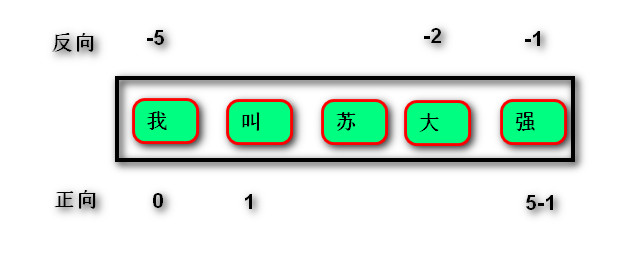
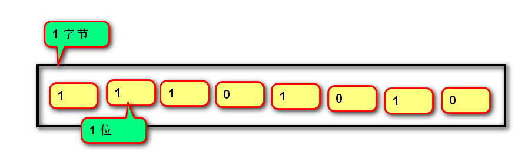
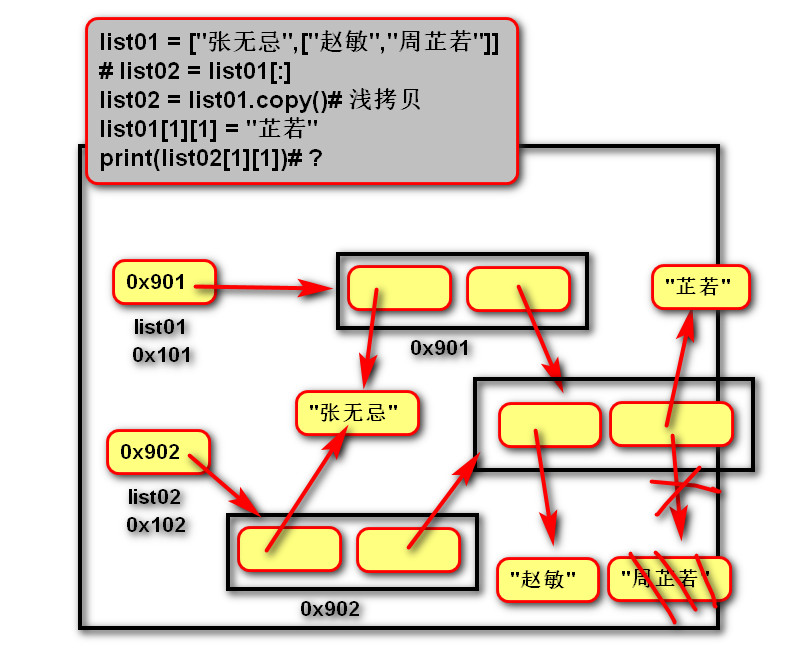
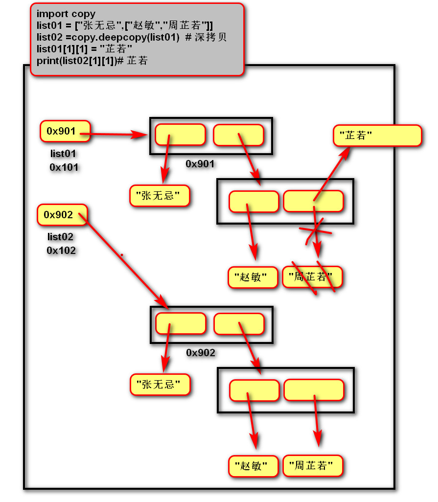

# 容器

- 统一存储、管理一系列数据

## 通用操作

- 数学运算符
  
  > 1. +=：用原容器与右侧容器拼接,并重新绑定变量
  > 2. *：重复生成容器元素
  > 3. *=：用原容器生成重复元素, 并重新绑定变量
  > 4. <   <=   >   >=   ==   !=：依次比较两个容器中元素的编码值大小,一但不同则返回比较结果。

- 成员运算符
  
  - 语法：
    
    > 数据 in 序列
    > 
    > 数据 not in 序列
  
  - 作用：判断数据是否在序列中，返回bool值

- 索引index
  
  - 语法：容器【整数】
  - 作用：根据索引值查找容器内的元素
  - 说明：
    - 正向索引：从0开始，第二个索引为1，最后一个为len(s)-1。
    - 反向索引：从-1开始,-1代表最后一个,-2代表倒数第二个,以此类推,第一个是-len(s)
    - 

- 切片slice
  
  - 作用：根据两个索引值获取容器内的元素块
  
  - 语法：容器[(索引值1)：(索引值2)(：步长)]
  
  - 说明：
    
    - ()内的内容可以省略
    
    - 步长是每次获取元素往后的偏移量，默认为1
    
    - 起始索引值包含，不包含介绍索引值

- 内建函数
  
  > 1. len(x) 返回序列的长度
  > 
  > 2. max(x) 返回序列的最大值元素
  > 
  > 3. min(x) 返回序列的最小值元素
  > 
  > 4. sum(x) 返回序列中所有元素的和(元素必须是数值类型)

## 字符串str

- 定义：由一系列的字符组成__不可变__序列容器，存储的是字符的编码值
  
  - 字符不可变性：
    
    ```
    name = "悟空"
    # 修改的只是变量name存储的地址，字符没有改变
    # 为什么不可变?:
    # 如果将两个字,改变为三个字,很可能破坏其他对象的内存空间
    # 所以字符串不能改变
    name = "孙悟空"
    ```

- 编码
  
  1. byte是最小的计算机存储单位，等于8个位bit
     
     - B    KB    MB    G    T    都是1024进制
     - 
  
  2. 字符：单个的数字、文字和符号
  
  3. 字符集（码表）
  
  4. 编码：将字符转换为对应的二进制序列的过程
  
  5. 解码：将二进制转换为对应的字符
  
  6. 编码方式：
     
     - ASCII编码：包含字母、数字等字符，每个字符占一个字节
     
     - GBK编码：国标拓展码，兼容ASCII编码，包含21003个中文，英文一个字节，中文两个字节
     
     - Unicode：国际统一编码（万国码），旧字符集每个占两个字节，新字符集占四个字节
     
     - UTF-8编码：Unicode编码的存储传输方式，英文占一个字节，中文占三个字节

- 编码相关函数
  
  - bin（整数）：将整数转换为二进制
  
  - ord（字符）：将字符转换为对应的编码值
  
  - chr（编码值）：将编码值装换为对应的字符

- 字面值
  
  - 单引号和双引号的区别
    
    - 只支持一行
    
    - 单引号里的双引号不算结束符
    
    - 双引号里的单引号不算结束符
  
  - 三引号
    
    - 常用于文档字符串（注释），且不占用内存
    
    - 可见即所得：
    
    - 在三引号中换行时自动转换位/n
    
    - 三引号中可包含单双引号
  
  - 转义符:
    
    - 语法：\ 反斜杠 + 特定的字符
    
    - 意义：改变原始字符串的含义
    
    - 解决字符串冲突的问题
    
    - 常用转义符: \n  \\\   \t   \0
    
    - 路径问题：
      
      > 原始字符串：取消转义
      > 
      > path = r"C:\aid1904\bay02"
  
  - __字符串的格式化__
    
    - 定义：生成一定格式的字符串
    
    - 语法：
      
      >  字符串%(变量)
      > 
      > " 我的名字是%s,年龄是%s" % (name, age)
    
    - 类型码
      
      > %s字符串  %d整数   %f浮点数
    
    - 格式: %[- + 0 宽度.精度]类型码
      
      > -: 左对齐(默认是右对齐)
      > 
      > +: 显示正号
      > 
      > 0 : 左侧空白位置补零
      > 
      > 宽度 : 整个数据输出的宽度
      > 
      > 精度 : 保留小数点后多少位
    
    - 案例
      
      ```
      print("我%d你"%(5))# 我5你
      print("我%-3d你"%(5))# 我5  你
      print("我%03d你"%(5))# 我005你
      print("%.2f"%(1.2355)) # 1.24
      ```

## 列表list

- 定义：由一系列变量组成的可变序列容器

- 作用：统一管理多个变量，存储和管理多个数据

- 适用性：根据该技术的特点，得出适用的情况
  
  - 可变：适用于需要修改元素个数和内容的情况，如录入学生信息
  
  - 序列：有顺序，能索引、切片，获取元素更灵活
  
  - 一系列变量：可读性差，没有键值对可读性好

- 基础语法：
  
  1. 创建列表：分成根据具体数据和可迭代对象创建
     
     列表名 = []
     
     列表名 = list(可迭代对象)
  
  2. 添加元素：往后添加和按索引添加
     
     列表名.append(元素)
     
     列表.insert(索引，元素)
  
  3. 定位元素：定位单个和定位多个
     
     索引、切片
  
  4. 遍历列表：直接遍历（简单）和通过索引间接遍历（灵活）
     
     > 正向：for 变量名 in 列表名:
     > 
     > 变量名（就是元素）
     > 
     > 反向： for 索引名 in range(len(列表名)-1,-1,-1):
     > 
     > 列表名[索引名]（就是元素）
  
  5. 删除元素：根据元素名或索引删除元素
     
     列表名.remove(元素)
     
     del 列表名[索引或切片]

- 深拷贝和浅拷贝
  
  1. 浅拷贝：是在拷贝过程中,***只复制一层变量***,不会复制深层变量绑定的对象的复制过程。
  
  2. 深拷贝：复制整个依赖的变量。
  
  ```
  import copy
  
  list01 = ["张无忌",["赵敏","周芷若"]]
  list02 =copy.deepcopy(list01)  # 深拷贝
  list01[1][1] = "芷若"
  print(list02[1][1])# 周芷若
  ```

- 内存图:浅拷贝和深拷贝的区别

- 

- 

- 列表VS字符串
  
  1. 字符串是不可变,列表是可变。
  
  2. 字符串中每个元素只能存储字符,而列表可以存储任意类型。
  
  3. 列表和字符串都是可迭代对象。
  
  4. 转换函数： 
     
     1. 将列表中的多个字符串拼接为一个。
     - result = "连接符".join(列表) --------追加字符（不会每次产生新对象，造成垃圾）
     
     ```
     # 需求：根据某些逻辑，拼接字符串
     str_result = ""
     for item in range(10):
     # 缺点：每次+ ,都会产生新的字符串对象．
     # 替换str_result变量存储的地址，而之前的对象成为垃圾
         str_result =str_result + str(item)
     print(str_result)
     ```
     
     2. 将一个字符串拆分为多个，并放在一个列表中。
     - 列表 = “a-b-c-d”.split(“分隔符”) -----适用于有分隔符
     
     - 没有分隔符
       
       ```
       list_result = []
       for item in range(10):
        # 向列表追加字符(不会每次产生新对象，造成垃圾)
        list_result.append(str[item])
       # list --> str
       str_result = "".join(list_result)
       print(str_result)
       ```

- 列表推导式   
  
  1. 定义：使用简易方法，将可迭代对象转换为列表。
  2. 语法：
     1. 变量 = [表达式 for 变量 in 可迭代对象]
     2. 变量 = [表达式 for 变量 in 可迭代对象 if 条件]
     3. 说明:如果if真值表达式的布尔值为False,则可迭代对象生成的数据将被丢弃。

- 列表嵌入式
  
  1. 语法：变量 = [表达式 for 变量1 in 可迭代对象1 for 变量2 in 可迭代对象2]
  
  ```
  # 传统写法：
  result = []
  for r in ["a", "b", "c"]:
  for c in ["A", "B", "C"]:
  result.append(r + c)
  #推导式写法：
  result = [r + c for r in list01 for c in list02]
  ```

- 列表的扩容:可变容器的属性
  
  1. 开辟新的更大的空间
  
  2. 拷贝之前的数据
  
  3. 替换引用

## 元组 tuple

- 定义
  
  1. 由一系列变量组成的不可变序列容器。
  
  2. 不可变是指一但创建，不可以再添加/删除/修改元素。

- 适用性：当元素个数固定且不需要改变，优先用元组
  
  - 不可变：和列表唯一的不同，固定的空间，没有预留空间

- 元组VS列表
  
  - 列表（读写）：预留空间
  
  - 元组（只读）：按需分配

- 基础操作
  
  1. 创建空元组：根据具体对象或可迭代对象创建
     
     - 元组名 = ()
     
     - 元组名 = tuple()
  
  2. 创建非空元组：
     
     - 元组名 = (20,)      //   一个元素时必须加一个逗号，元组名=(20)是整数不是元组
     
     - 元组名 = (1, 2, 3)
     
     - 元组名 = 100,200,300　// 括号可以省略
     
     - 元组名 = tuple(可迭代对象)
  
  3. 获取元素：
     
     - 索引、切片
  
  4. 遍历元组：用法和列表一致
     
     - 正向：
       
       > for 变量名 in 列表名:
       > 
       > 变量名就是元素
     
     - 反向：
       
       > for 索引名 in range(len(列表名)-1,-1,-1):
       > 
       > 元祖名[索引名]就是元素

- 应用：
  
  > 变量交换的本质就是创建元组：x, y = y, x（x，y= （y，x））
  > 
  > 格式化字符串的本质就是创建元祖："姓名:%s, 年龄:%d" % ("tarena", 15)

## 字典 dict

- 定义
  
  1. 由一系列**键值对**组成的可变**散列**容器。
  
  2. 散列：每条记录无序。
  
  3. 键必须惟一且不可变(字符串/数字/元组)，值没有限制。

. 适用性：特点如下

  . 键值对：哈希原理，查找速度很快，但相对列表占用更大的内存

    . 键名唯一，代码可读性更好

  . 散序：无序，只能通过键索引，且不能切片

  . 可变：预留空间

- 基础操作
  
  1. 创建字典：
     
     - 字典名 = {键1：值1，键2：值2}
     
     - 字典名 = dict (可迭代对象)
  
  2. 添加/修改元素：第一次放是添加，之后放是修改
     
     - 语法: 字典名[键] = 数据
     
     - 说明:
       
       - 键不存在，创建新记录。
       
       - 键存在，修改映射关系。
  
  3. 获取元素：
     
     - 变量 = 字典名[键]   //没有键则错误
  
  4. 遍历字典：
     
     - 变量所有的键：for 键名 in 字典名：字典名[键名]
     
     - for 键名,值名 in 字典名.items():  语句
     
     - 遍历所有的值： for  值名 in 字典名.value():   值名   
  
  5. 删除元素：del 字典名[键]
  
  6. 将两字典拼接：dict03 = {\*\*dict01，*\*dict02}

- 字典推导式
  
  - 定义：使用简易方法，将可迭代对象转换为字典。
  
  - 语法:{键:值 for 变量 in 可迭代对象}      {键:值 for 变量 in 可迭代对象 if 条件}
    
    - 主要考虑变量和键、值之间的联系，怎么去实现转换
  
  - ```
    """
     (1)字典：键－列表的元素　　值：元素的长度
     (2)将两个列表按顺序合并成字典
    """
    list_input = ["adf", "wer", "s", "sd"]
    dict_input = {item: len(item) for item in list_input}
    print(dict_input)
    
    list_input2 = [101, 102, 103, 104]
    dict_input = {list_input[i]: list_input2[i] for i in range(len(list_input))}
    print(dict_input)
    ```

- 字典 VS 列表
  
  1. 都是可变容器。
  
  2. 获取元素方式不同,列表用索引,字典用键。
  
  3. 字典的插入,删除,修改的速度快于列表。
  
  4. 列表的存储是有序的,字典的存储是无序的。

- 字典和列表的选择
  
  ```
  1,2获取学生信息，需要通过索引,代码可读性差.
  {
    "张三":["男",100,25],
    "李四":["男",100,25]
  }
  
  相比1,4,获取学生更灵活．
  [
    ["张三","男",100,25],
    ["李四","男",100,25],
  ]
  
  相比１，２内存占用过多
  [
    {"name":"张三","sex":"男","score":100,"age":25},
    {"name":"李四","sex":"男","score":100,"age":25},
  ]
  
  相比2,3查找人的速度快
  {
    "张三" :{"sex":"男","score":100,"age":25},
    "李四":{"sex":"男","score":100,"age":25},
  }
  
  序列：有序  灵活(索引／切片)
  散列：无序  速度快　　可读性更高
  ```

## 集合 set

- 定义
  
  1. 由一系列**不重复的不可变类型**变量组成的可变散列容器。
     
     - 不可变类型变量有：数，字符串，元组
  
  2. 相当于**只有键没有值**的字典(键则是集合的数据)

. 适用性：

  . 不重复：

  . 数学运算:

- 基础操作
  
  - 创建空集合：
    - 集合名 = set()
    
    - 集合名 = set(可迭代对象)
  - 创建具有默认值集合：
    - 集合名 = {1, 2, 3}
    
    - 集合名 = set(可迭代对象)   //会自动删除可迭代对象中的重复元素
  - 添加元素：集合名.add(元素)
  - 删除元素：集合名.discard(元素)
    - 集合名,remove(元素)
  - 查询元素：没有查询功能，只能间接转换位列表查询
  - 遍历元素：和列表相同

- 运算
  
  1. 交集&：返回共同元素。
     
     s1 = {1, 2, 3}
     
     s2 = {2, 3, 4}
     
     s3 = s1 & s2 # {2, 3}
  
  2. 并集 |：返回不重复元素
     
     s1 = {1, 2, 3}
     
     s2 = {2, 3, 4}
     
     s3 = s1 | s2 # {1, 2, 3, 4}
  
  3. 补集 - ：返回只属于其中之一的元素
     
     s1 = {1, 2, 3}
     
     s2 = {2, 3, 4}
     
     s1 - s2 # {1} 属于s1但不属于s2
     
     补集 ^ ：返回不同的的元素
     
     s1 = {1, 2, 3}
     
     s2 = {2, 3, 4}
     
     s3 = s1 ^ s2 # {1, 4} 等同于(s1-s2 | s2-s1)
  
  4. 子集<：判断一个集合的所有元素是否完全在另一个集合中,完全被包含
  
  5. 超集>：判断一个集合是否具有另一个集合的所有元素，完全包含
     
     s1 = {1, 2, 3}
     
     s2 = {2, 3}
     
     s2 < s1 # True
     
     s1 > s2 # True
  
  6. 相同或不同== !=：判断集合中的所有元素是否和另一个集合相同。
     
     s1 = {1, 2, 3}
     
     s2 = {3, 2, 1}
     
     s1 == s2 # True
     
     s1 != s2 # False
     
     子集或相同,超集或相同 <= >=

- 集合推导式
  
  1. 定义：
     
     使用简易方法，将可迭代对象转换为集合。
  
  2. 语法:
     
     {表达式 for 变量 in 可迭代对象}
     
     {表达式 for 变量 in 可迭代对象 if 条件}

## 固定集合 frozenset

- 定义: 不可变的集合。

- 作用:固定集合可以作为字典的键,还可以作为集合的值。

- 基础操作
  
  - 创建固定集合：frozenset(可迭代对象)

- 运算: 等同于set
